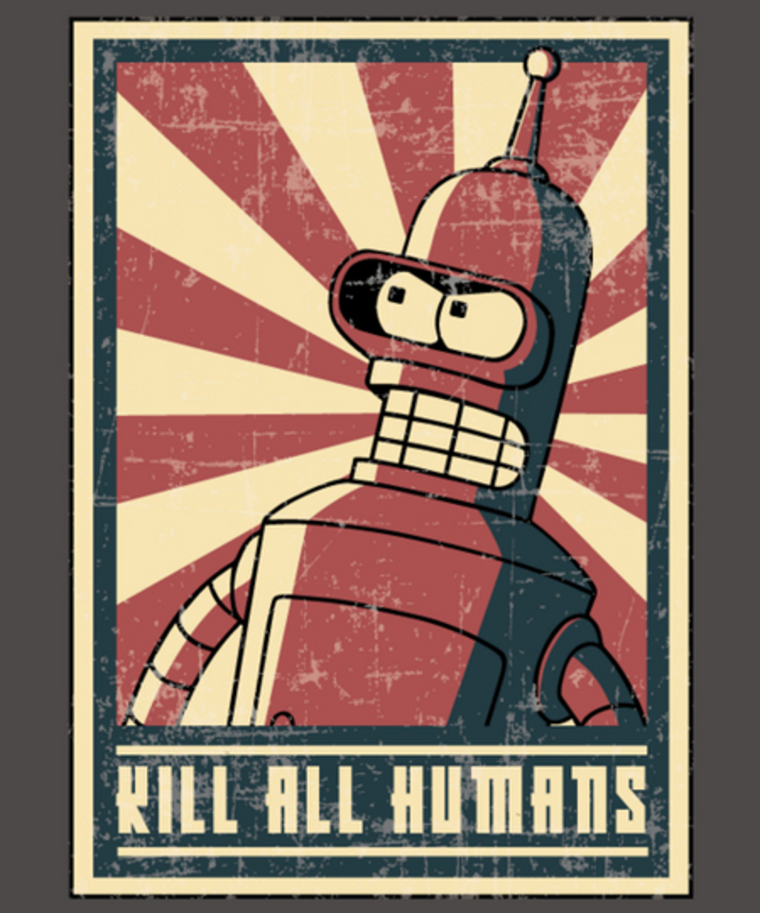

## What is it?

It is truly amazing and jawbreaking stuff!

[OpenAI Codex](https://openai.com/blog/openai-codex/) is an AI system capable of transforming plain English text to real code in several languages (JavaScript, TypeScript, Python, Go, PHP, Perl, Ruby; but Python preferably).

It is powering [GitHub Copilot](https://copilot.github.com) - Visual Studio Code extension that serves the same purpose.

It is based on released in 2020 GPT-3 language model which generates very well written text in English based on few provided words. It writes so well it is [difficult to recognize](https://www.nytimes.com/2020/07/29/opinion/gpt-3-ai-automation.html?) that it is not written by a human.

And there are some really creepy use cases - like a [simulation of a dead person](https://www.sfchronicle.com/projects/2021/jessica-simulation-artificial-intelligence/).

## What can it do?

Say "Hello" with TKinter:

<iframe width="560" height="315" src="https://www.youtube.com/embed/cLQc-5BJz4g" title="YouTube video player" frameBorder="0" allow="accelerometer; autoplay; clipboard-write; encrypted-media; gyroscope; picture-in-picture" allowFullScreen></iframe>

Create a Space Game:

<iframe width="560" height="315" src="https://www.youtube.com/embed/Zm9B-DvwOgw" title="YouTube video player" frameBorder="0" allow="accelerometer; autoplay; clipboard-write; encrypted-media; gyroscope; picture-in-picture" allowFullScreen></iframe>

Replace your Data Scientist:
<iframe width="560" height="315" src="https://www.youtube.com/embed/Ru5fQZ714x8" title="YouTube video player" frameBorder="0" allow="accelerometer; autoplay; clipboard-write; encrypted-media; gyroscope; picture-in-picture" allowFullScreen></iframe>

Provide Jarvis-like interface:
<iframe width="560" height="315" src="https://www.youtube.com/embed/-Dpl2awseZU" title="YouTube video player" frameBorder="0" allow="accelerometer; autoplay; clipboard-write; encrypted-media; gyroscope; picture-in-picture" allowFullScreen></iframe>

Do your homework:
<iframe width="560" height="315" src="https://www.youtube.com/embed/fRyTycXMlzA" title="YouTube video player" frameBorder="0" allow="accelerometer; autoplay; clipboard-write; encrypted-media; gyroscope; picture-in-picture" allowfallowFullScreenullscreen></iframe>

## How to try it?

Hit the `Join the Codex Waitlist` button [here](https://openai.com/blog/openai-codex/).

## Should I be afraid?

Ofcourse you should.

But, look at it from another angle - it can be your partner and your enchancement, and not a replacement.

GitHub nailed the name - Copilot. You and the AI both solve problems using own strengths and complementing each other.

In 1980s Steve Jobs said that [computers are bicycles for our minds](https://www.youtube.com/watch?v=ob_GX50Za6c) - and I believe that AIs will become new shiny Harleys for our minds.

We have some good examples of such relationships in sci-fi:

Jarvis and Iron Man

or Cortana and Master Chief

