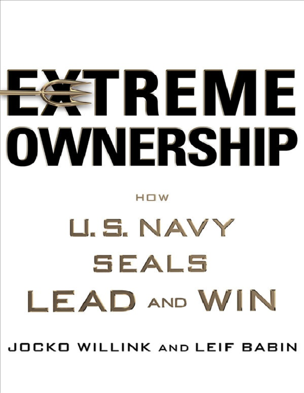

If you can read one and only one book on leadership (from, let's be honest, thousands of them) you really should consider [Extreme Ownership by Jocko Willink](https://www.amazon.com/Extreme-Ownership-U-S-Navy-SEALs/dp/1250067057).
This is THE most simple, straight and clear book on leadership I've ever read.

Advice: get +10 Leadership points by LISTENING to an audiobook, which is narrated by the author with his astounding voice (you can check it on his [Youtube channel](https://www.youtube.com/channel/UCkqcY4CAuBFNFho6JgygCnA)).

# My notes

## On ownership
- True leader takes 100% ownership of everything in his domain
- If something is wrong - the leader doesn't blame others, he takes full responsibility for the outcome and searches what he must do as a leader to create success

## On leaders
- Leaders have a great impact on a team's performance
- Leaders should not tolerate poor performance, they should hold subordinates accountable, enforce standards

## On beliefs
- Leader must believe in his mission and understand the underlying purpose
- Subordinates should see this belief and understand the WHY

## On team mistakes and success
- Leaders take ownership of the team's mistakes, but they don't take credit for the team's success

## On ego
- Ego restricts your ability to take ownership of mistakes
- Leaders checks their ego, stay humble, confident, but not arrogant

## On debriefs
- After every mission, you should do a debriefing (what went right, what went wrong, how can we adapt) 

## On leading up (often overlooked thing for managers btw)
- Leaders should push situational awareness up to their superiors and secure their support for the team and mission

## On leading down
- Leaders must explain to team members their role in the mission

## On team size
- Break teams into 4-5 operators an decentralize command

## Laws of combat
- Cover and move
  - Leaders support and encourage teamwork - this is the only way to success
- Simple
  - Leaders simplify their strategy and plans as much as possible to avoid any misunderstanding and increase focus
- Prioritize and Execute
  - Leaders must determine the highest priority task and execute it
- Decentralized command
  - Leaders must delegate not only tasks but the planning process itself as much down the chain of command as possible
