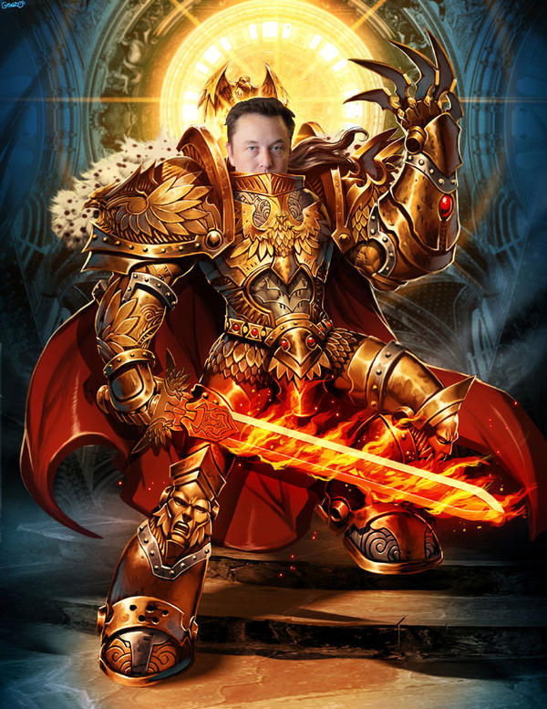

Coding Sans has released a wonderful report on Engineering Management - [`State of Engineering Management 2022`](https://codingsans.com/blog/engineering-management).

Let's see what caught my eye ;)

The Report has five sections:
1. Leadership, Self-improvement
2. Hiring, Retaining, Engineering Brand
3. Remote work
4. People management

# Leadership, Self-Improvement

## What are the most important soft skills in leadership?

Unsurprisingly, we see Communication, Problem-solving and Interpersonal skills as champions - indeed they are crucial for (almost) any manager. I could argue about Problem-solving skills for C- level as they can compensate for lack of such skills with good hires on their teams, but we are talking about engineering managers here ;)

Time management is on the 4th place and I mostly disagree with that, seeing that we (managers) often fail to manage not time, but our priorities and mental energy.

Leadership demeanour is something that I also can't agree on this list - demeanour, as far as I understand, is a way of externally visible behaviour which can be way different than real things that a person does, so I would remove it from the list completely ;)

What I don't see on the list, but I think is important:
- Accountability
- Client-centricity
- Awareness/Сonsciousness
- People-care

Because if we have an engineering management who have great Communication, Problem-solving, Interpersonal skills, but have zero care for the client and his team - I don't think we can call him a good manager.

Btw, I heavily recommend this book on leadership: [Extreme Ownership by Jocko Willink](2022-04-11-extreme-ownership-book-notes.md).

## Learning and Knowledge Sharing

### Knowledge sharing

An amazingly big number of managers who speak in podcasts, make videos and write books!

But still, 1-1 mentorship is the most popular choice to spread knowledge and blog posts coming next - no surprises here.

### Preferred way to learn

Look at it - `by mentoring` is waaaaaay lower than most other options ;) 
Reading blog posts is, again no surprise here, champion with books coming second, and videos coming third.

In my opinion, the most preferred way to learn is `Reading books` - it gives you structured, wide, good covered knowledge on a topic.
But. We don't write books fast enough (and don't read them fast enough either ;) ), so blog posts are good enough replacement for books on cutting edge and recent topics. But if you have a choice - read a book or read a blog post - go read a book ;)

But here is the thing that made me happy - videos go AFTER books. That's great - we still have a chance as humanity to resist TikTok virus, eating our brains :P

Btw, I have a nice reading list for engineering managers [here](2022-04-12-team-lead-starter-books.md).

## Hiring and Retention

### Hiring methods

Unfortunately, I have a different experience here - I would say these are the champions:
1. In-house recruiters (but, I think, we have some of the best recruiters in the market) - they give us the most hires
2. Employee referrals - low in number of hires, but high in quality

### Hiring criteria

In my opinion, I would say:
1. Cultural fit - we don't hire anyone without cultural fit no matter how he is great at everything else - this is one of the top priorities at our company
2. Work Experience - unfortunately, we can't afford to hire only for soft skills and train on the job, so we are looking for developers with specific work experience
3. Soft skills - weak soft skills is also no-hire for us

In my opinion, almost the same thing goes here:
1. Cultural fit
2. Soft skills
3. Work experience

### How do you attract developers/managers

We attract with almost everything on the list, except Stock options.
And we mostly not looking on a college degree - I don't think it is a must-have in 2022.

### Motivation

As we are a relatively small company we don't have a lengthy career path (which is sad), but I mostly agree with other criteria placement.

Interestingly, top items mostly comply with the list from [Drive by Daniel Pink](https://www.amazon.com/Drive-Surprising-Truth-About-Motivates/dp/1594484805):
- Autonomy
- Mastery
- Purpose

## Remote Work

We worked in hybrid mode for years, so switching to remote in COVID-times was very easy for us.
Nowadays we work mostly remotely with the ability to go to the office if you want or need to.

I don't think we will return (I mean obligatory) to the office. Remote Work became a must-have benefit for any IT company that wants to attract and retain good developers.
Just look at this:
- Amazon intercepts Tesla's employees after Musk calls them to office: ["If the Emperor of Mars doesn't want you, I'll be happy to bring you over"](https://www.businessinsider.in/tech/news/recruiters-at-major-companies-like-amazon-are-going-after-tesla-employees-angered-by-elon-musks-return-to-office-demand-if-the-emperor-of-mars-doesnt-want-you-ill-be-happy-to-bring-you-over/articleshow/91990873.cms)
- [Apple's Top Executive Quits Company Over Return To Office Policy](https://www.ndtv.com/world-news/apples-top-executive-quits-company-over-return-to-office-policy-report-2962565)

God-Emperor of Mars by <a href="https://www.deviantart.com/samuildt/art/God-Emperor-of-Mars-Elon-Musk-746156129">SamuilDT</a>

I don't think we have experienced higher turnover, performance issues and unhappy employees due to remote work.
Communication issues are also not a problem at all.
But employee isolation and team culture become more 'troubling' with time.

## People Management

The results are quite shocking for me :)
Measuring developer performance based on LoC in the year 2022? Wat? How is it even possible?!
Code readability? How do you measure that? By number of WTF per minute in the code review? Very muddy metric.
Speed of developer? Really? In LoC per hour? 

We mostly try not to measure individual performance focusing instead on teams and their goals.

Can't imagine why customer/stakeholder satisfaction is so low on this list - he is the reason we do what we do :)

Our top-4 mostly look like this:
1. On-time delivery
2. Working software
3. Stakeholder satisfaction
4. Budget

