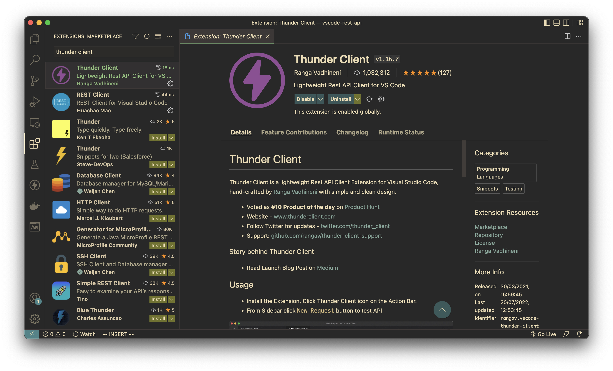

# Why would someone need to replace Postman?

Nowadays developers work with different APIs (I think, mostly with REST API) a lot - building, consuming or both.
And it is a frequent need - to test some API calls, inspect what it returns, make some adjustments to our code, and... repeat until satisfied.

This is a part of the developer's inner loop and it should be as smooth and as fast as possible.

If you use VS Code for coding and Postman for inspecting different APIs behaviors you will need to switch between those applications - switch your context - this is not smooth enough and can make you a little less productive than you can be.

Not only you need to switch between apps, you are also switching between different project contents - your source code folder (most likely in some git repository) and completely distinct Postman workspace (although, which could be put in git with some effort).

# What we can use instead of Postman in Visual Studio Code?

What if we could work with all that API probing data, examples, etc. in the same repository as our code and do all we need from the same IDE without the need to switch anywhere?

Well, we can ;)

There are two most popular Visual Studio Code extensions in the Marketplace:
- [REST Client](https://marketplace.visualstudio.com/items?itemName=humao.rest-client)
- [Thunder Client](https://marketplace.visualstudio.com/items?itemName=rangav.vscode-thunder-client)

Let's look at them.

## REST Client

### What can it do?

- Send HTTP Requests directly from VS Code (with syntax highliht, autocompletion, etc.)
- GraphQL support
- cURL commands support
- Multiple requests per file
- Different authentication protocols support
- Environments and variables support
- Generate code snippets for requests
- Cookies memory

You can see the whole description in the [Marketplace](https://marketplace.visualstudio.com/items?itemName=humao.rest-client).

### How to install REST Client extension in VS Code

1. Go to the `Extensions` tab
2. Search `REST Client`
3. Press `Install`.


### How to use REST Client extension in VS Code

Let's start with `GET` requests.

1. Create a folder for your requests (I'll name mine `requests`)
2. Create a file `cats.http` (it needs to have `http` or `rest` (`.md` seems also to work with http-codeblocks) file extension for REST Client extension to work)

You can commit this file to your source control alongside your application's source code.

The syntax for this file is simple:

```http
### [Request description]
[VERB] [QUERY]
[HEADERS]

[BODY]
```

Do you love cats? Of course, you do - everyone loves them!

Let's consume some of the cats' APIs:

{:start="3"}
3. Write request to `cats.http`:
```http
### Get some facts about cats
GET https://cat-fact.herokuapp.com/facts
```

Notice the `Send Request` link - press it and VS Code will execute your request and open a new tab with the results:


What if I don't want to see facts about cats - I want to see cats themselves?

{:start="4"}
4. Write this request to `cats.http`:

```http
### Get cat picture
GET https://cataas.com/cat
```
Notice that we now have 2 requests in our file and 2 links to send requests. Press the second link and enjoy a picture of the most perfect species on Earth:


### Adding headers to REST Client requests

Now let's add some headers to our requests. We will use this API: https://docs.thecatapi.com/example-by-breed

1. Add this to your `cats.http`:

```http
### Get cat breeds
GET https://api.thecatapi.com/v1/breeds

### Get images of cats with breed X
GET https://api.thecatapi.com/v1/images/search?breed_ids=beng
```
If we execute the first request, we will see a list of cats breeds, that we need to pass to the second request.

Let's try to execute the second request with `breed_id=beng`:


We are getting only a couple of attributes, but we want to know more! So we need to register for an API key.

{:start="2"}
2. Go to https://thecatapi.com and register for an API key
 

Now add a new header to your second request - `X-API-KEY` with the value you received in an e-mail after registration:

```http
### Get images of cats with breed X
GET https://api.thecatapi.com/v1/images/search?breed_ids=beng
X-API-KEY: xxxxxxxxxxx
```
and execute it - now we see a bunch of data on Bengal cats!


### Adding variables to REST Client requests

So what if we wanted to get images of another breed? Let's use variables!

General syntax for variables is simple - just place \{\{VariableName}} in your request.

There are two types of variables in REST Client extension:
- Custom Variables with syntax \{\{CustomVariableName}}
- System Variables with syntax \{\{$SystemVariableName}}

#### System variables
For system variables we have:
  - \{\{guid}} - RFC 4122 v4 UUID
  - \{\{processEnv [%]variableName}} - returns local machine env. variable
  - \{\{dotenv [%]variableName}} - returns env. variable from `.env` file from the same folder as `.http` file
  - and a few more

#### Custom variables

Custom Variables also could be of different types:
- Environment variables (which are not the same as normal Environment Variables - these are just variables defined in the context of different...
  environments :D - local, production, testing, etc.) - they are defined in the workspace settings file and are scoped to your workspace
- File variables - defined in requests file and scoped to it
- Prompt variables - VS Code will prompt value from the user before sending the request
- Request variables - you can use values returned from one request in your next requests (e.g. authentication requests, resource creating, etc.)

For now, we will settle with File variables.

1. Add variables definition at the top of our `.http` file:

```http
@theCatApiBaseUrl=api.thecatapi.com
@theCatApiKey=xxxxxxxxxxx
@breed=abys
```

{:start="2"}
2. Replace values in our last request with variables:

```http
### Get images of cats with breed X

GET https://{{theCatApiBaseUrl}}/v1/images/search?breed_ids={{breed}}
X-API-KEY: {{theCatApiKey}}

```

The file should look like this:
```http
@theCatApiBaseUrl=api.thecatapi.com
@theCatApiKey=xxxxxxxxxxx
@breed=abys

### Get some facts about cats
GET https://cat-fact.herokuapp.com/facts

### Get cat picture
GET https://cataas.com/cat

### Get cat breeds
GET https://api.thecatapi.com/v1/breeds

### Get images of cats with breed X

GET https://{{theCatApiBaseUrl}}/v1/images/search?breed_ids={{breed}}
X-API-KEY: {{theCatApiKey}}

```

{:start="3"}
3. Execute the request and see that it still works:


### Using environment variables in REST Client

**Note**: those are not droids you are looking for... ehm, those are not system Environment variables ;)
{: .notice--info}

Let's assume that we want to use different API keys to get breed information depending on our environment.

1. First, we need to create workspace-scoped `settings.json` file:
- Open VS Code `Settings`
- Switch to `Workspace` tab
- Search for `Rest-client: Environment Variables`
- Click `Edit in settings.json`


{:start="2"}
2. Move File variable `theCatApiBaseUrl` to `$shared` section (it will be shared between all of the environments), add two more sections for our environments and specify API keys:

```json
{
    "rest-client.environmentVariables": {
        "$shared": {
            "theCatApiBaseUrl": "api.thecatapi.com"
        },
        "Development": {
            "theCatApiKey": "xxxxxxxxxxxxxxx"
        },
        "Production": {
            "theCatApiKey": "yyyyyyyyyyyyyyy"
        }
    }
}
```
**Note**: NEVER specify your API keys, logins and passwords and other secrets in project files that will be committed to source control - use system Environment variables or Secret Vaults.
{: .notice--warning}

{:start="3"}
3. Delete File scoped variables `theCatApiBaseUrl` and `theCatApiKey` from our `.http` file 

Your file should look like this now:

```http
@breed=abys

### Get some facts about cats
GET https://cat-fact.herokuapp.com/facts

### Get cat picture
GET https://cataas.com/cat

### Get cat breeds
GET https://api.thecatapi.com/v1/breeds

### Get images of cats with breed X
GET https://{{theCatApiBaseUrl}}/v1/images/search?breed_ids={{breed}}
X-API-KEY: {{theCatApiKey}}
```

But you will see an error that `theCatApiKey` is not found. That's because it is not present in `$shared` scope and we did not choose our current environment.

{:start="4"}
4. Choose `Development` environment:
You can choose it from the menu in the bottom right corner of the status bar:

Or you can press `F1` to bring `Command palette` and choose `Rest Client: Switch environment`.

{:start="5"}
Execute the request and see that it works as expected


### Making POST requests in REST Client

What if we want to Vote for the cat we liked most? 

[TheCatApi](https://docs.thecatapi.com/api-reference/votes/votes-post) demands that we do this with a POST request.


POST requests are done almost the same as GET:

1. Add POST request to your requests file:
   
```json
### Post a vote for a cat (Cat for president!)
POST https://{{theCatApiBaseUrl}}/v1/votes
Content-Type: application/json
X-API-KEY: {{theCatApiKey}}

{
  "image_id": "asf2",
  "value": 1
}
```
{:start="2"}
2. Execute the request and vote for your cat!


### Using GraphQL with REST Client extension

Okay, we voted for the cat, now let's dive into another theme - Star Wars.

The Internet has everything about cats and Star Wars. Even the [Star Wars APIs](https://swapi.dev/documentation)

But we will go a step further and consume it with GraphQL.

There is a [GraphQL wrapper](https://studio.apollographql.com/public/star-wars-swapi/home?variant=current) around this REST API which we will use.

1. Create a new file `starwars.http`
2. Add this request to it:

```graphql
### GraphQL Example
POST https://swapi-graphql.netlify.app/.netlify/functions/index
Content-Type: application/json
X-REQUEST-TYPE: GraphQL

query Query {
  allFilms {
    films {
      title
      director
      releaseDate
      speciesConnection {
        species {
          name
          classification
          homeworld {
            name
          }
        }
      }
    }
  }
}
```

{:start="3"}
3. Execute and enjoy!


### Copying request as cURL

Just right-click your request and select `Copy Request as cURL` (or from `Command palette` use `Rest Client: Copy Request as cURL`). That's simple. 

### Generating code

Almost the same as copying requests as cURL.

Select request and select `Generate Code Snippet` from right-click menu or use `Command palette`->`Rest Client: Generate Code `Snippet`, then choose your preferred language.


## Thunder Client

Main features:
- UI resembling Postman
- Collections and Environment variables
- GraphQL support
- Scriptless API Testing
- Git sync
- Import from Postman, Insomnia, etc.

You can see the whole description in the [Marketplace](https://marketplace.visualstudio.com/items?itemName=rangav.vscode-thunder-client)

Overall it looks like a simple version of Postman embedded in VS Code.

### Install Thunder Client extension for Visual Studio Code

1. Go to `Extensions` tab
2. Search `Thunder client`
3. Press `Install`.



### GET Requests with Thunder Client

Let's replicate our Get random cat fact request in Thunder Client.

1. Open the Thunder client window from the left pane
2. Go to the `Collections` tab and create a new Collection `Cats`


{:start="3"}
3. Click `...` next to `Cats` collection and choose `New Request`, name it `catfact`


{:start="4"}
4. Put `https://cat-fact.herokuapp.com/facts` in the request string and click `Send`. Your response will be in the bottom section of the screen.


Overall this extension is very good at resembling Postman features and UI, so no need to write any `HowTo` - it's quite obvious :)